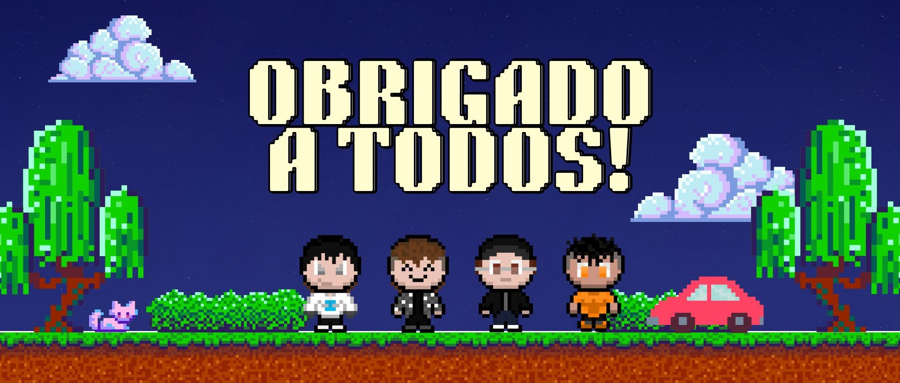

# 🌐 Sociedade Web  
**Tecnologia, Interação Social e Comunidades Virtuais**

O **Sociedade Web** é um projeto que busca criar um ambiente virtual interativo onde usuários podem se conectar através de personagens personalizados, explorar ambientes, participar de mini games e refletir sobre o impacto da tecnologia na sociedade.  
Inspirado por plataformas como **Habbo Hotel**, **Club Penguin**, **Stardew Valley** e **Roblox**, o projeto combina interação social, estética em pixel art e uma abordagem educacional sobre tecnologia e sociedade.

---

## 📌 Visão Geral

O objetivo principal do projeto é desenvolver **uma plataforma de interação social**, permitindo:

- Conexão entre usuários  
- Exploração de ambientes virtuais  
- Customização de personagens  
- Mini games e interatividade  
- Reflexão sobre a sociedade digital  

O projeto surgiu como parte de um estudo sobre tecnologia e sociedade, enfatizando a formação de comunidades e o papel das interações digitais.

---

## 🎯 Objetivos do Projeto

### **Objetivo Geral**
Criar uma plataforma interativa baseada em personagens e ambientes virtuais, promovendo interação social e construção comunitária.

### **Objetivos Específicos**
- 🧍‍♂️ Criação e customização de personagens  
- 🔐 Sistema de registro e login  
- 🏙️ Ambientes virtuais  
- 🎮 Mini games interativos  
- 💬 Mecanismos de interação social  
- 🛡️ Moderação e segurança  
- 📚 Abordagem educativa sobre tecnologia e sociedade  

---

## 🎨 Design e Identidade Visual

O projeto utiliza estética **pixel art (32px)** com foco em:

- Visual minimalista  
- Paletas vibrantes  
- Sprites criados em Aseprite e Pixilart  
- Ambientes construídos com Tiled  
- Experiência acessível e leve  

---

## 🕹️ Mecânicas do Jogo

- Criação e personalização de personagens  
- Ambientes virtuais exploráveis  
- Mini games interativos  
- Exploração, colaboração e presença social  

---

## 🧠 Abordagem Educativa

O projeto incentiva:

- Discussões sobre tecnologia e sociedade  
- Reflexões sobre interações digitais  
- Colaboração entre usuários  
- Compreensão do impacto da tecnologia nas relações humanas  

---

## 🛠️ Tecnologias Utilizadas

### **Frontend**
- HTML  
- CSS  
- JavaScript  

### **Ferramentas**
- VSCode  
- Aseprite  
- Pixilart  
- Tiled  
- GitHub  
- Netlify  

### **Outros**
- Banco de Dados  
- Programação orientada a objetos no backend  

---

## 📘 Metodologia de Desenvolvimento

- Pesquisa científica sobre o tema  
- Criação de diagramas  
- Divisão de equipe  
- Planejamento semanal  
- Testes de sistema  

---

## 🚀 Impacto Social

O Sociedade Web busca:

- Promover conexões digitais  
- Incentivar a colaboração entre usuários  
- Representar a evolução da tecnologia na sociedade  
- Criar um espaço virtual seguro e engajador  

---

## ⚠️ Desafios Enfrentados

- Criação de ambientes interativos  
- Integração de diferentes ferramentas  
- Manutenção de segurança e privacidade  
- Desenvolvimento de design acessível  
- Estruturação da moderação  

---

## 🔗 Links Importantes

- 🧾 **Repositório GitHub:**  
  https://github.com/hebcodee/SociedadeWeb

- 🗂️ **Trello do projeto:**  
  https://trello.com/b/5RKQviyr/sociedade-web

---

## 📚 Referências

- Castells, Manuel — *A Sociedade em Rede*  
- Heidegger, Martin — *A Questão da Técnica*  
- Turkle, Sherry — *Reclaiming Conversation*  
- Schwab, Klaus — *The Fourth Industrial Revolution*  

---

## 🧩 Conclusão

O **Sociedade Web** proporciona um espaço virtual dinâmico e educativo, permitindo que os usuários explorem experiências sociais e reflitam sobre o impacto da tecnologia na sociedade moderna.

---

## 🙏 Agradecimentos

Agradecemos a todos que contribuíram para o projeto — colegas, mentores e participantes das pesquisas.

---
